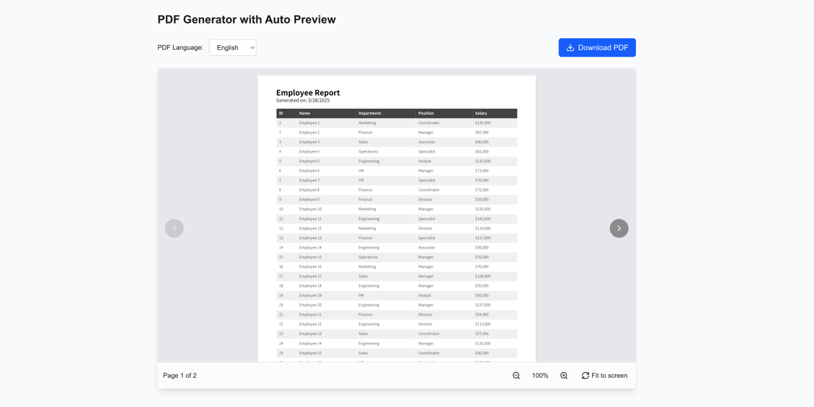

# Next.js PDF Generation & Viewing Solution

This project provides a comprehensive solution for PDF generation and viewing in web applications using Next.js. It integrates multiple libraries to solve common challenges in client-side PDF handling, including multilingual support, table generation, viewing, and interactive features.



## 🔥 Features

- **PDF Generation** with jsPDF and jsPDF-AutoTable
- **Multilingual Support** with embedded CJK fonts (Source Han Sans)
- **PDF Viewing** with react-pdf
- **Interactive Features** like zoom, pan, and pinch with react-zoom-pan-pinch
- **Modern UI** built with Next.js 15 and React 19
- **TypeScript Support** for improved development experience

## 🚀 Why This Project Exists

Creating and viewing PDFs in web applications presents several challenges:

1. **Font embedding** for multilingual support (especially CJK languages)
2. **Table generation** with proper formatting
3. **PDF viewing** directly in the browser
4. **Interactive controls** for better user experience
5. **Client-side generation** without server dependencies

This project offers a clean integration of multiple libraries to solve these problems in a modern Next.js application.

## 📋 Prerequisites

- Node.js 18+ (LTS recommended)
- pnpm (recommended) or npm/yarn

## 🛠️ Installation

1. Clone this repository:
```bash
git clone https://github.com/fanzzzd/nextjs-jspdf-autotable.git
cd nextjs-jspdf-autotable
```

2. Install dependencies:
```bash
pnpm install
# or
npm install
# or
yarn install
```

3. Start the development server:
```bash
pnpm dev
# or
npm run dev
# or
yarn dev
```

4. Open [http://localhost:3000](http://localhost:3000) with your browser to see the result.

## 🧩 Key Components

### PDF Generation with jsPDF and AutoTable

This project includes pre-configured jsPDF setup with:

- Font embedding for multilingual support
- Table generation via jspdf-autotable
- Styling and formatting utilities

Example usage:

```tsx
import { jsPDF } from 'jspdf';
import 'jspdf-autotable';

// Import font definition files
import "@/fonts/SourceHanSans-normal.js";
import "@/fonts/SourceHanSans-bold.js";

// Create a new PDF document
const generatePDF = () => {
  // Initialize with a font supporting CJK characters
  const doc = new jsPDF();
  
  // Set the font
  doc.setFont('SourceHanSans');
  
  // Add content
  doc.text('Hello World - 你好，世界 - こんにちは世界', 10, 10);
  
  // Add a table
  doc.autoTable({
    head: [['Name', '名称', 'Price']],
    body: [
      ['Product A', '产品A', '$10.00'],
      ['Product B', '产品B', '$20.00'],
      ['Product C', '产品C', '$30.00'],
    ],
    styles: {
      font: 'SourceHanSans',
      fontStyle: 'normal',
    },
    headStyles: {
      fontStyle: 'bold',
    },
  });
  
  // Save or open the PDF
  doc.save('example.pdf');
};
```

### PDF Viewing with react-pdf

The project includes a PDF viewer component using react-pdf:

```tsx
import { useState } from 'react';
import { Document, Page, pdfjs } from 'react-pdf';
import 'react-pdf/dist/esm/Page/AnnotationLayer.css';
import 'react-pdf/dist/esm/Page/TextLayer.css';

// Set the worker source
pdfjs.GlobalWorkerOptions.workerSrc = '/pdf.worker.min.mjs';

const PDFViewer = ({ url }) => {
  const [numPages, setNumPages] = useState(null);
  const [pageNumber, setPageNumber] = useState(1);

  function onDocumentLoadSuccess({ numPages }) {
    setNumPages(numPages);
  }

  return (
    <div className="pdf-viewer">
      <Document
        file={url}
        onLoadSuccess={onDocumentLoadSuccess}
      >
        <Page pageNumber={pageNumber} />
      </Document>
      <div>
        <p>
          Page {pageNumber} of {numPages}
        </p>
        <button
          disabled={pageNumber <= 1}
          onClick={() => setPageNumber(pageNumber - 1)}
        >
          Previous
        </button>
        <button
          disabled={pageNumber >= numPages}
          onClick={() => setPageNumber(pageNumber + 1)}
        >
          Next
        </button>
      </div>
    </div>
  );
};

export default PDFViewer;
```

### Interactive PDF Experience with react-zoom-pan-pinch

Enhance the PDF viewing experience with zoom, pan, and pinch controls:

```tsx
import { TransformWrapper, TransformComponent } from 'react-zoom-pan-pinch';
import { Document, Page } from 'react-pdf';

const InteractivePDFViewer = ({ url }) => {
  return (
    <TransformWrapper
      initialScale={1}
      initialPositionX={0}
      initialPositionY={0}
    >
      {({ zoomIn, zoomOut, resetTransform }) => (
        <>
          <div className="tools">
            <button onClick={() => zoomIn()}>+</button>
            <button onClick={() => zoomOut()}>-</button>
            <button onClick={() => resetTransform()}>Reset</button>
          </div>
          <TransformComponent>
            <Document file={url}>
              <Page pageNumber={1} />
            </Document>
          </TransformComponent>
        </>
      )}
    </TransformWrapper>
  );
};
```

## 🧠 Advanced Usage

### Combining Generation and Viewing

Create a complete PDF workflow where users can generate and then immediately view PDFs:

```tsx
import { useState } from 'react';
import { jsPDF } from 'jspdf';
import 'jspdf-autotable';
import { Document, Page } from 'react-pdf';
import { TransformWrapper, TransformComponent } from 'react-zoom-pan-pinch';

// Import font definition files
import "@/fonts/SourceHanSans-normal.js";
import "@/fonts/SourceHanSans-bold.js";

const PDFWorkflow = () => {
  const [pdfBlob, setPdfBlob] = useState(null);

  const generatePDF = () => {
    const doc = new jsPDF();
    
    // Set the font
    doc.setFont('SourceHanSans');
    
    // Add content
    doc.text('Generated PDF with CJK Support - 中文支持', 10, 10);
    
    // Create a blob from the PDF
    const blob = doc.output('blob');
    setPdfBlob(blob);
  };

  return (
    <div className="pdf-workflow">
      <button onClick={generatePDF}>Generate PDF</button>
      
      {pdfBlob && (
        <div className="pdf-viewer">
          <TransformWrapper>
            {({ zoomIn, zoomOut, resetTransform }) => (
              <>
                <div className="tools">
                  <button onClick={() => zoomIn()}>+</button>
                  <button onClick={() => zoomOut()}>-</button>
                  <button onClick={() => resetTransform()}>Reset</button>
                </div>
                <TransformComponent>
                  <Document file={pdfBlob}>
                    <Page pageNumber={1} />
                  </Document>
                </TransformComponent>
              </>
            )}
          </TransformWrapper>
        </div>
      )}
    </div>
  );
};
```

## 📝 Implementation Notes

### Font Loading Strategy

For CJK (Chinese, Japanese, Korean) support, this project includes:

1. Pre-processed font files in JavaScript format (in the `src/fonts` directory)
2. Direct imports of the font files (no need for explicit VFS loading)

This approach ensures proper display of CJK characters in the generated PDFs without requiring server-side processing.

### PDF Worker Configuration

To ensure proper loading of the PDF.js worker:

1. Worker file is stored in the public directory
2. Worker is referenced in the PDF viewer component:
   ```js
   pdfjs.GlobalWorkerOptions.workerSrc = '/pdf.worker.min.mjs';
   ```

## 🔧 Troubleshooting

### Common Issues

1. **PDF Font Issues**
   - Make sure the font JavaScript files are correctly imported
   - Verify the correct font names are used in `setFont` calls
   - Check for any console errors related to font loading

2. **PDF Worker Not Found**
   - Ensure the PDF.js worker file is in the public directory
   - Verify the worker path is correctly set in your code
   - Try using an absolute path if relative paths aren't working

3. **PDF Generation Performance**
   - Large tables or complex content may cause performance issues
   - Consider implementing pagination or chunking for large datasets
   - Use a loading indicator for PDF generation operations

4. **PDF Viewing on Mobile**
   - Test the zoom-pan-pinch functionality on various devices
   - Add responsive design considerations for mobile viewports
   - Ensure touch controls are properly handled

5. **Multilingual Text Issues**
   - If CJK characters are not displaying properly, ensure font imports are correct
   - Check that the font name matches exactly in `setFont` calls
   - Try using a different encoding if necessary

## 📚 Resources

- [jsPDF Documentation](https://artskydj.github.io/jsPDF/docs/jsPDF.html)
- [jsPDF-AutoTable Documentation](https://github.com/simonbengtsson/jsPDF-AutoTable)
- [react-pdf Documentation](https://react-pdf.org/)
- [react-zoom-pan-pinch Documentation](https://github.com/prc5/react-zoom-pan-pinch)
- [Next.js Documentation](https://nextjs.org/docs)

## 📄 License

This project is MIT licensed - see the LICENSE file for details.

## 👉 Next Steps

1. Add better error handling for PDF operations
2. Implement PDF form filling capabilities
3. Add PDF annotation features
4. Create more comprehensive examples for different use cases
5. Add automated tests for PDF generation and viewing workflows
6. Support for more complex layouts and styling
7. Integration with data sources and APIs
8. PDF password protection and security features

## 🙏 Contributions

Contributions are welcome! Please feel free to submit a Pull Request.

---

Built with ❤️ using Next.js 15, React 19, jsPDF, react-pdf, and react-zoom-pan-pinch.